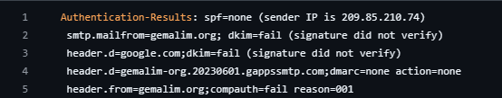
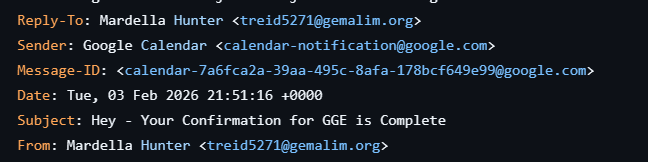
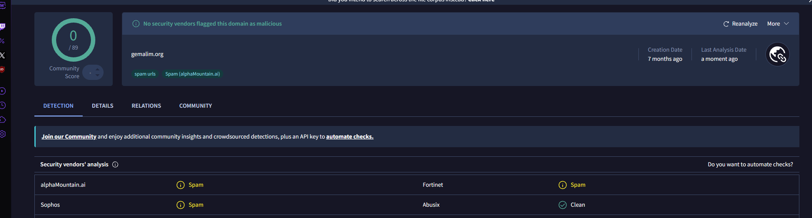
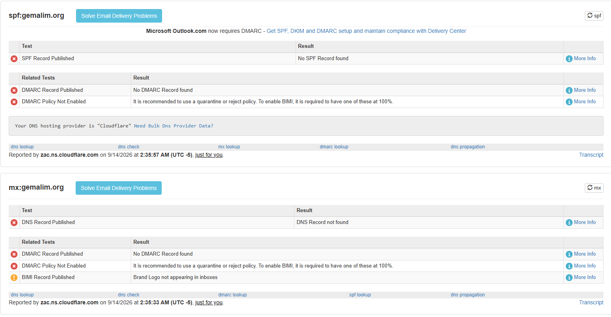
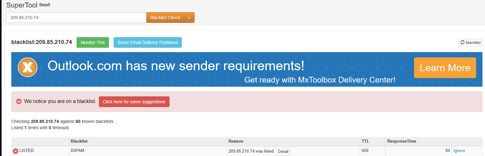
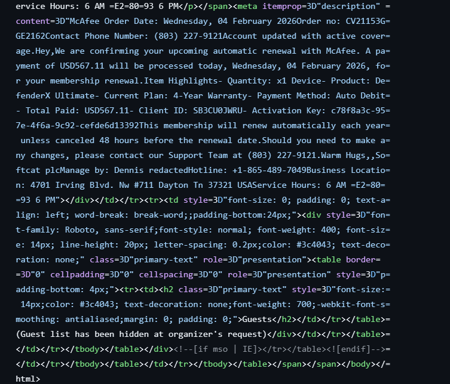

# Case 01 — McAfee renewal callback scam delivered via Google Calendar invite

| | |
|---|---|
| **Verdict** | **Malicious** |
| **Severity** | Low–Medium — commodity callback scam; no malware or link payload, but the fake USD 567.11 charge is designed to make recipients phone the attacker |
| **Type** | Callback phishing (telephone-oriented attack delivery, "TOAD") |
| **Sample** | `031a34cf755e1774016d4d4ed1d6ea5c8185d3091bdabdd67739ad6a6c42ad6b.eml` |
| **MITRE ATT&CK** | T1566.004 — Phishing: Spearphishing Voice |

## 1. Summary

An email claiming to confirm an automatic McAfee subscription renewal of USD 567.11, sent from an unrelated domain (`gemalim[.]org`) and delivered through a Google Calendar invitation. Both DKIM signatures fail, the sender domain publishes no SPF or DMARC record, and the only call to action is a phone number — the hallmark of a callback scam, where the victim is talked into granting remote access or "refund" payments over the phone.

## 2. Header analysis

### Initial findings

As soon as we open up the raw file of the email we are immediately greeted with a red flag. As we can see the DKIM test returned a fail giving us the description that the signature did not verify, this means that the email has been tampered with.

> **Correction for review:** a DKIM *fail* means the signature did not verify — it does not by itself prove tampering. It can also be caused by the sending server signing incorrectly, a rotated key, or a mailing list modifying the body in transit. Here it is a strong red flag in combination with `spf=none`, `dmarc=none`, and `compauth=fail`, but the safer wording is "the message cannot be authenticated as originating from the claimed sender."

Upon further inspection we can see that the Reply-to and the From field are identical but this is not enough to disprove that this might be a malicious email.

> **Added observation:** the `Sender:` header is `calendar-notification@google[.]com` and the `Message-ID` is a `calendar-…@google.com` identifier. This email was not sent as a normal message — it was generated by **creating a Google Calendar event with the victim as a guest**, so Google's own infrastructure delivered the notification. The body even ends with "Guest list has been hidden at organizer's request." This is a known spam/phishing technique for bypassing sender-reputation filtering, and it explains why the sending IP belongs to Google (see §3).

### Authentication results

*(table added — values read directly from the header screenshot above)*

| Check | Result | Notes |
|---|---|---|
| SPF | **none** | `smtp.mailfrom=gemalim.org` publishes no SPF record; sender IP `209.85.210[.]74` |
| DKIM | **fail** ×2 | `header.d=google.com` and `header.d=gemalim.org.20230601.gappssmtp.com` — both signatures failed to verify |
| DMARC | **none** | no policy published for `gemalim[.]org`; `action=none` |
| Composite (compauth) | **fail**, reason=001 | Microsoft's overall authentication verdict |

### Sender fields

| Field | Value (defanged) |
|---|---|
| From | Mardella Hunter `<treid5271@gemalim[.]org>` |
| Reply-To | Mardella Hunter `<treid5271@gemalim[.]org>` — identical to From |
| Sender | Google Calendar `<calendar-notification@google[.]com>` |
| Sender IP | `209.85.210[.]74` (Google outbound) |
| Message-ID | `calendar-7a6fca2a-39aa-495c-8afa-178bcf649e99@google.com` |
| Subject | Hey - Your Confirmation for GGE is Complete |
| Date | Tue, 03 Feb 2026 21:51:16 +0000 |

## 3. Sender validation & reputation

To further research lets try and lookup the domain gemalim.org on virustotal to see its reputation

Upon checking the reputation of the domain in virustotal we can see that it passed the test where virustotal uses different security vendors to identify if the domain is malicious. Although its good to note that some have flagged this domain as spam.

Now lets go ahead and use mxlookup for search up the domain.

Upon searching up the domain we can clearly see that there are no matching results for the domain, which we were already told on the first line of the email header spf=none. There are also no records published for the dmarc.

Now lets check the sender IP

Upon checking the ip on the blacklist tool on mxtoolbox we can see that the ip of the is on the blacklist. Although the question is this ip is on the spf list of google so why is it on the blacklist? The reason is this ip is google's shared outbound mail infrastructure which is used million of accounts, the reason its on the blacklist is most probably due to other user accounts being compromised and then being used for spam or phishing emails.

| Indicator | VirusTotal | MXToolbox blacklist |
|---|---|---|
| `gemalim[.]org` | clean by vendors; some spam flags | no SPF / DMARC / MX records |
| `209.85.210[.]74` | — | listed on 0SPAM (1 of 60) — shared Google infrastructure, not attributable to this sender |

## 4. Content analysis

Now lets dive into the actual contents of the email before we make our verdict.

As you can see the email is all about a subscription renewal for McAfee which is an antivirus tool, but the interesting key of information we've gathered is that the email contains the renewing of product for McAfee but the email of the sender is from gemalim.org which is not associated whatsoever with the company itself which is another red flag to note.

> **Added observation — the payload is a phone number, not a link.** The body states that USD 567.11 "will be processed today" and instructs the recipient to call `(803) 227-9121` or the hotline `+1-865-489-7049` to make changes. There is no URL. This is the callback-phishing pattern: the fake charge creates urgency, the victim phones the number, and the "support agent" then pushes remote-access software or a fraudulent refund. The invented order number, activation key, and client ID exist only to make the notice look system-generated.

## 5. Payload

- **Links:** none
- **Attachments:** none
- **Callback numbers:** `(803) 227-9121`, `+1-865-489-7049`

## 6. Verdict & reasoning

*(no verdict was written for this case in the original document — this section is a Claude draft for review)*

**Malicious.** The message fails every authentication check that can be applied to it (SPF none, both DKIM signatures fail, no DMARC, compauth fail), originates from a domain with no relationship to McAfee and no mail infrastructure of its own, and was injected through a Google Calendar invitation to borrow Google's sending reputation. The content is a textbook fake-renewal lure whose only action is to phone the attacker. The sender IP's blacklist listing is *not* evidence against this email specifically — it is Google's shared outbound pool — but nothing else about the message can be authenticated.

## 7. Indicators of Compromise

| Type | Value (defanged) | Context |
|---|---|---|
| Email | `treid5271@gemalim[.]org` | From / Reply-To |
| Domain | `gemalim[.]org` | sender domain, no SPF/DMARC/MX |
| IPv4 | `209.85.210[.]74` | sender IP — Google shared outbound, low confidence as a standalone IOC |
| Phone | `(803) 227-9121` | callback lure — "Support Team" |
| Phone | `+1-865-489-7049` | callback lure — "Hotline" |
| String | `CV21153G-GE2162` | fake order number — useful for mailbox search |
| Message-ID | `calendar-7a6fca2a-39aa-495c-8afa-178bcf649e99@google.com` | exact-match purge key |
| File hash | `031a34cf755e1774016d4d4ed1d6ea5c8185d3091bdabdd67739ad6a6c42ad6b` | .eml sample (SHA-256) |

## 8. MITRE ATT&CK

| ID | Technique | How it applies |
|---|---|---|
| T1566.004 | Phishing: Spearphishing Voice | the lure directs the victim to call a number controlled by the attacker (callback phishing) |
| T1566.003 | Phishing: Spearphishing via Service | delivered by abusing Google Calendar invitations rather than direct SMTP |

## 9. Recommended actions

1. Block `treid5271@gemalim[.]org` and the `gemalim[.]org` domain at the mail gateway.
2. Search all mailboxes for the Message-ID and the subject line, and purge; also search for the order number `CV21153G-GE2162` to catch variants.
3. Add both phone numbers to the internal block/awareness list so they can be matched in future tickets.
4. Report the abusing Google Calendar account to Google (abuse@google.com) — the invite mechanism is the delivery vector.
5. Do **not** block `209.85.210[.]74` — it is Google's shared outbound mail infrastructure and blocking it would drop legitimate Gmail / Workspace mail.
6. Users: a reminder that genuine McAfee renewal notices come from McAfee domains and that unexpected "charges" should be checked in the account portal, never by phoning a number in the email.
