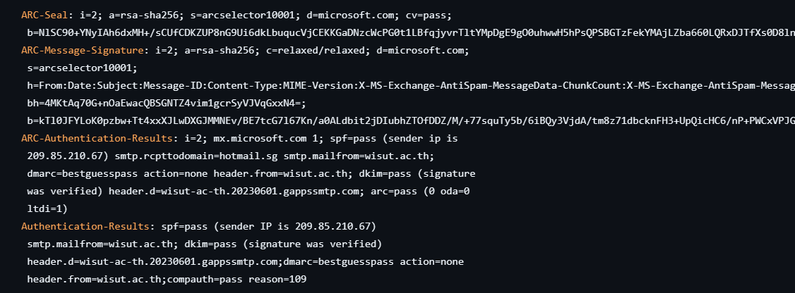
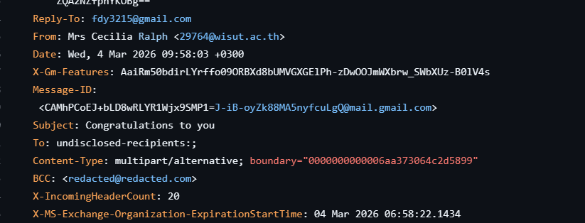
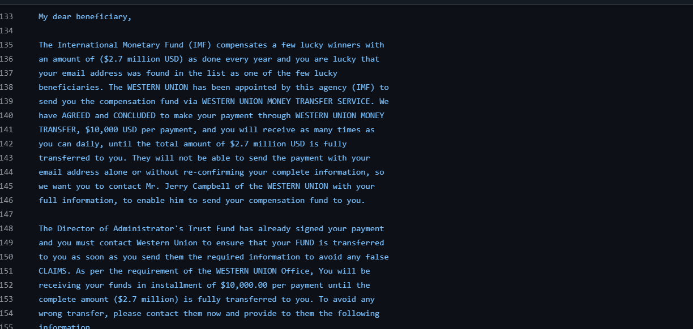
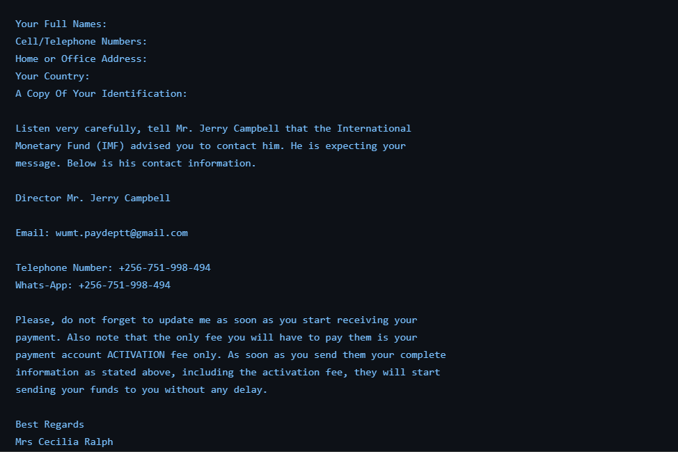
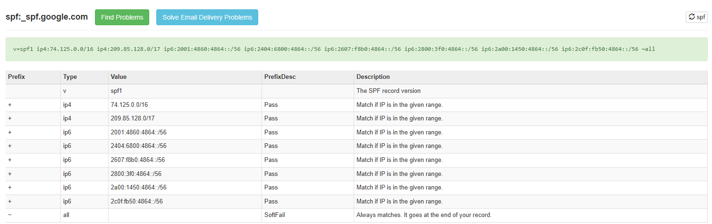
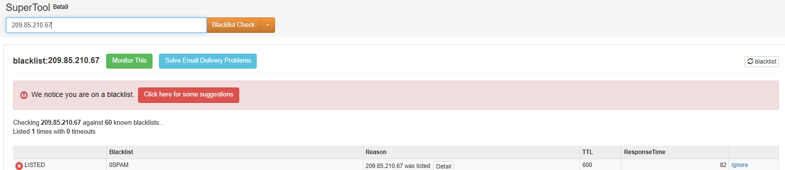
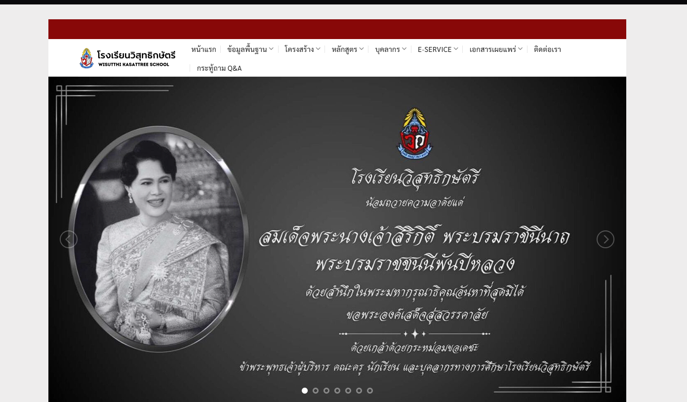

# Case 02 — IMF / Western Union lottery scam sent from a compromised university account

| | |
|---|---|
| **Verdict** | **Malicious** |
| **Severity** | Low — commodity advance-fee fraud with no link or attachment; the risk is a recipient replying with personal and banking details |
| **Type** | Advance-fee fraud (419) sent from a compromised legitimate account |
| **Sample** | `0c82d0952bae458461ceccc56a90d36436a07d871fab89d8cabab71e06acdb79.eml` |
| **MITRE ATT&CK** | T1598 — Phishing for Information · T1586.002 — Compromise Accounts: Email Accounts |

## 1. Summary

A "you have won USD 2.7 million from the IMF" email that passes SPF, DKIM, and composite authentication because it was genuinely sent from a real Thai university domain (`wisut.ac[.]th`) through Google Workspace. The sender account is compromised: the message went to `undisclosed-recipients`, the Reply-To points to an unrelated Gmail address, and the content has nothing to do with the sending institution. This is the case where authentication results alone would produce the wrong answer.

## 2. Header analysis

### Initial findings

Upon opening the email header we are greeted with many things that can aid us in verifying the email.

On the authentication results field we can see that the spf analysis returned a pass along with the dkim analysis which means that this email has not been tampered with. So far there are no red flags to note yet, but we will manually check this spf and dkim analysis later as further verification would not hurt.

As we further read the email we find questionable information

The Reply-To and the From field as different which sometimes doesn't automatically disqualify an email from being illegitimate. However, in this case the email addresses are what's really questionable here, these are not legitimate email addresses or known ones. We will further explore this on the mxsupertool.

> **Added observations from the same screenshot:**
> - `To: undisclosed-recipients:;` — the message was mass-mailed via BCC. A legitimate personal notification is addressed to a named recipient; a hidden bulk recipient list is a strong scam indicator on its own.
> - The `Message-ID` begins with `CAMhPCoEJ…@mail.gmail.com` — the `CA…@mail.gmail.com` pattern means it was composed in the Gmail web interface, consistent with someone logged into the compromised Workspace account rather than a bulk-mailing tool.
> - `dmarc=bestguesspass` is not a real DMARC pass. It means `wisut.ac[.]th` publishes **no DMARC record** and Microsoft inferred a pass from SPF/DKIM alignment. The domain has no DMARC policy that could have blocked abuse of its own accounts.

### Authentication results

*(table added — values read directly from the header screenshot above)*

| Check | Result | Notes |
|---|---|---|
| SPF | **pass** | sender IP `209.85.210[.]67` is within Google's SPF, which `wisut.ac[.]th` includes |
| DKIM | **pass** | `header.d=wisut-ac-th.20230601.gappssmtp.com` — signed by the domain's Google Workspace tenant |
| DMARC | **bestguesspass** | no DMARC record published; inferred, not enforced |
| ARC | pass | chain sealed by microsoft.com, i=2 |
| Composite (compauth) | **pass**, reason=109 | authentication is genuine — the account, not the headers, is the problem |

### Sender fields

| Field | Value (defanged) |
|---|---|
| From | Mrs Cecilia Ralph `<29764@wisut.ac[.]th>` |
| Reply-To | `fdy3215@gmail[.]com` — **does not match From** |
| To | `undisclosed-recipients:;` (mass BCC) |
| Sender IP | `209.85.210[.]67` (Google outbound) |
| Message-ID | `<CAMhPCoEJ+bLD8wRLYR1Wjx9SMP1=J-iB-oyZk88MA5nyfcuLgQ@mail.gmail.com>` |
| Subject | Congratulations to you |
| Date | Wed, 4 Mar 2026 09:58:03 +0300 |

## 3. Content analysis

Contents of the Email.

Alright, upon reading the contents of the email we can deduce that is an email telling someone that they have won something as their email was luckily chosen for the jackpot prize yearly. And then proceeds to ask for their personal information.

> **Added detail:** the lure is a USD 2.7 million "compensation fund" from the IMF, to be paid via Western Union in USD 10,000 instalments once the recipient sends their "complete information" to a "Mr. Jerry Campbell." No link, no attachment — the payload is the reply itself. This is classic advance-fee fraud: the personal data is harvested first, then a "processing fee" is requested before any payment.

## 4. Sender validation & reputation

Now proceeding to the mxsupertool analysis for the spf and dmarc.

So far so good the ip of the sender matches what we saw from the mxsupertool as the domain wisut.ac.th includes the spf of google.com which contains the ip of the sender.

Lets now check the IP of the sender

Upon checking the ip of the sender once again it gave us that its listed in the blacklist.

Looking up the domain:

Upon searching the domain we can see that it's a legitimate site and a legitimate school, this now explains why the spf and dkim passed because it's a legitimate domain rather than something an attacker just created on the spot. This also explains why they included google.com in their spf list because they use google workspace within the institution.

| Indicator | Reputation | Notes |
|---|---|---|
| `wisut.ac[.]th` | legitimate | real educational institution on Google Workspace; the domain itself is not malicious — one of its accounts is |
| `209.85.210[.]67` | listed on 0SPAM (1 of 60) | Google shared outbound pool, same caveat as Case 01 — not attributable to this sender |
| `fdy3215@gmail[.]com` | — | Reply-To; throwaway address controlled by the fraudster |

## 5. Payload

- **Links:** none
- **Attachments:** none
- **Ask:** reply with full personal details to the Reply-To address / "Mr. Jerry Campbell"

## 6. Verdict & reasoning

This email is somewhat difficult to assess as there are a mix of green flags aswell as redflags which include the ip of the sender being listed within the spf list of google.com while also being found on the blacklist. But if we were to take one thing from this entire email if would be that the contents are not associated with the sender of the email or even the email they plugged in the contents to contact them. The email tells them its from the IMF and to contact the IMF but upon observation the contact email, reply to, and from field are all not associated with the IMF. The sender of the email itself is from a school, a school would not send an email with contents regarding winning a million-dollar prize. My conclusion for this is that the email is from a compromised account, this explains why it passed the dkim and spf test properly thus giving a combination of green and red flags. This shows us how important context, research, and analytical skills are when it comes to looking at emails as they might seem legitimate and come from a reputable email or domain.

> **Editorial note:** the reasoning above is the strongest part of this casebook — reaching *compromised account* from a message that passes every authentication check is exactly the judgement call that separates analysis from checklist-following. Two supporting points worth adding to the verdict: the `undisclosed-recipients` mass-mailing and the Gmail-web Message-ID both corroborate "someone logged into a real account and blasted a scam," rather than spoofing.

## 7. Indicators of Compromise

| Type | Value (defanged) | Context |
|---|---|---|
| Email | `29764@wisut.ac[.]th` | From — compromised legitimate account |
| Email | `fdy3215@gmail[.]com` | Reply-To — attacker-controlled |
| IPv4 | `209.85.210[.]67` | sender IP — Google shared outbound, low confidence as a standalone IOC |
| Message-ID | `<CAMhPCoEJ+bLD8wRLYR1Wjx9SMP1=J-iB-oyZk88MA5nyfcuLgQ@mail.gmail.com>` | exact-match purge key |
| String | "Mr. Jerry Campbell", "Administrator's Trust Fund" | lure text — useful for content-based mailbox search |
| File hash | `0c82d0952bae458461ceccc56a90d36436a07d871fab89d8cabab71e06acdb79` | .eml sample (SHA-256) |

## 8. MITRE ATT&CK

| ID | Technique | How it applies |
|---|---|---|
| T1598 | Phishing for Information | the goal is to harvest personal and banking details via reply, not to deliver a payload |
| T1586.002 | Compromise Accounts: Email Accounts | sent from a genuine university Workspace account under attacker control, inheriting its SPF/DKIM reputation |

## 9. Recommended actions

1. Block `fdy3215@gmail[.]com` (the Reply-To) at the gateway — this is the address the fraud actually depends on.
2. Block `29764@wisut.ac[.]th` as a sender **temporarily**; do not block the whole `wisut.ac[.]th` domain, which is a legitimate institution.
3. Search all mailboxes for the Message-ID and the subject "Congratulations to you" and purge.
4. Notify the institution's abuse / IT contact that account `29764` is compromised, so they can reset it — this is the only action that stops the source.
5. Do **not** block `209.85.210[.]67` — Google shared outbound infrastructure.
6. If any user replied: treat their submitted personal data as exposed and follow the identity-theft response process.
